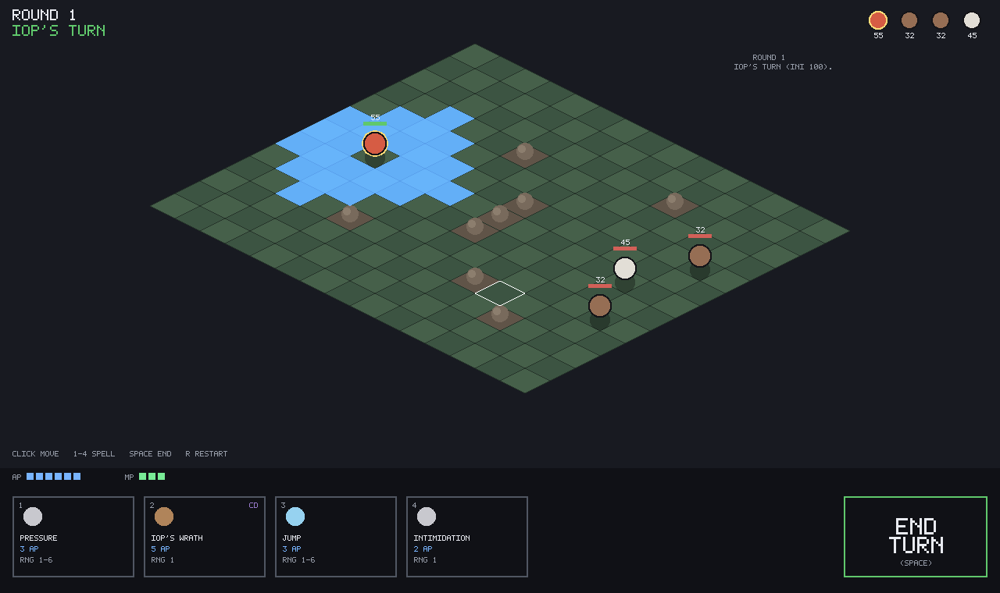
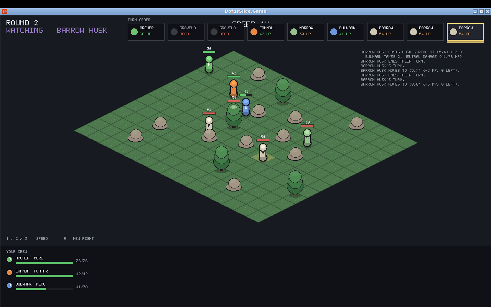
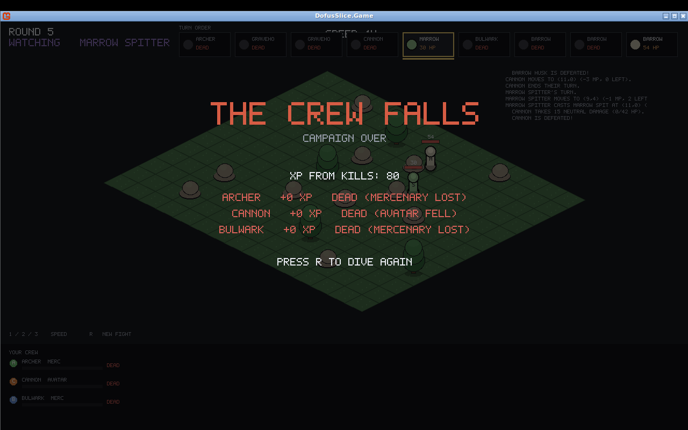
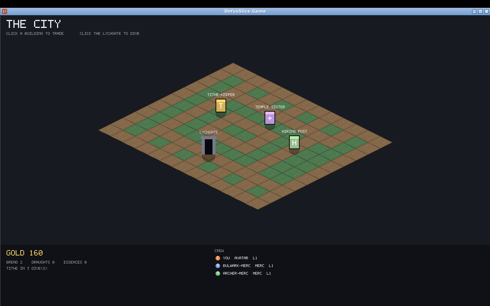
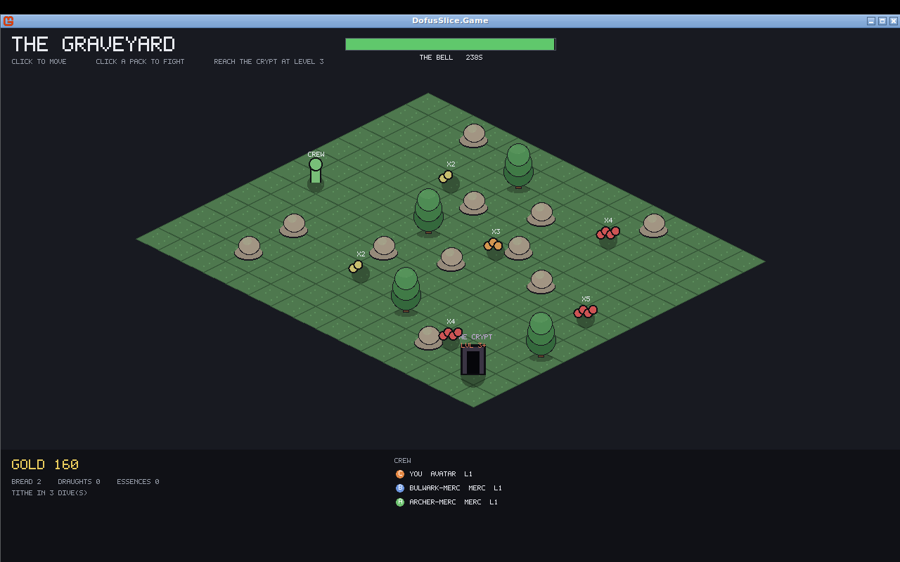
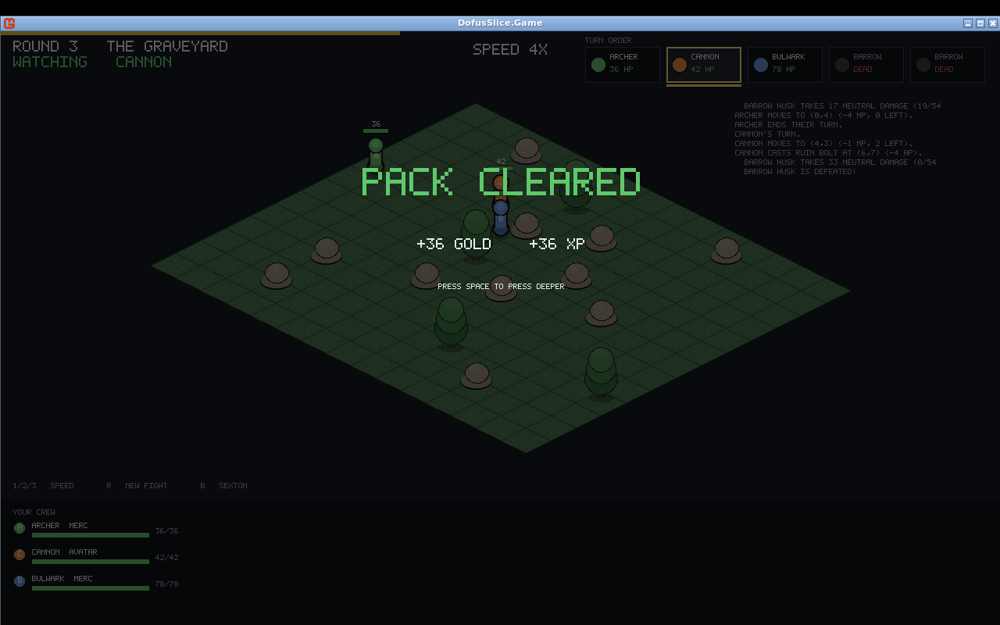

# Dofus Slice — Incarnam Combat (from-scratch engine)

A tiny, self-contained tactical-combat engine written from scratch in **C# + MonoGame**,
recreating the feel of Dofus 1.29's turn-based grid fights. This is a fun learning side
project — **not** related to the main product in this repo — living entirely under
`DofusSlice/` so it never touches the WipShare client.

The current vertical slice is a **combat sandbox**: drop straight into one Incarnam map as an
**Iop** and fight a group of mobs (a Gobball and two Boars) with the full turn loop —
movement points, action points, spells with range / line-of-sight / area-of-effect, mob AI,
and win/lose.



> **On assets & IP.** This project reimplements *mechanics* only. All art here is drawn
> procedurally (colored iso diamonds, disc tokens, an embedded bitmap font) — there are **no
> Ankama assets** in the repo. The data layer is deliberately shaped like a datamined spell /
> monster row so you can plug your own art or datamined data in later, but shipping Ankama's
> copyrighted art/sound publicly would be a copyright issue — keep any such assets local.

## TITHE — watched-combat prototype (the current focus)

The engine is now the foundation for **TITHE**, a dark single-player dungeon-crawl whose combat
uses the exact Dofus grammar above but is **watched, not piloted**: every unit — your whole crew
*and* the enemy pack — fights by an AI *policy*. Your skill lives *around* the fight (who to bring,
where to place them, what to engage), Loop-Hero/Moonlighter style. This is the prototype that
validates "is it fun to watch?" before any art (see `TITHE_slice_bible` for the full design).



**The vertical slice (Bible M1):** place a crew of three — **Cannon** (avatar) + two hired
**mercenaries** (Bulwark, Archer) — on the Graveyard, press **FIGHT**, and watch. Four legible
policies drive it: the **Bulwark** holds the front, the **Archer** kites and shoots the softest
target, the **Cannon** holds a mid sightline and nukes, and the two flanking skeleton
**Gravehounds** (high initiative) dive your squishy backline before your shooters can react. Wins
are common but rarely free — a downed mercenary **dies permanently**, a downed player-managed unit
is dragged out **Wounded**, and if the whole crew falls it is **campaign over**. That cost *is* the
tension: with the default placement, ~86% of dives are contained (usually costing a mercenary) and
~14% snowball into a wipe. Tucking the backline away from the Gravehounds' lanes is what turns a
costly win into a clean one — placement is the skill.



**Kit depth.** Each class has a **passive** that changes what you watch: the Archer's *Long Shot*
hits harder from range 6+, the Bulwark's *Rage Below* hits harder while bloodied, the Cannon's
*Overchannel* banks its unspent AP into the shot. Defeated mobs roll their **essence** as loot.
There's a full skeleton bestiary — armored **Crypt Wardens** (self-shield *Ironhide*), a swarm of
**Grave Mites** (*Sap* drains MP), a **Bone Piper** that feeds its allies AP — and the boss, **The
Sexton**: a huge slow monster whose court does the tactical work, with a guaranteed essence drop.

```bash
cd DofusSlice
dotnet run --project DofusSlice.Game            # TITHE watched combat (default)
dotnet run --project DofusSlice.Game -- boss    # fight The Sexton's court instead of the pack
dotnet run --project DofusSlice.Game -- 4       # start on a specific RNG seed (seed 4 is a defeat)
dotnet run --project DofusSlice.Game dofus      # the original piloted Dofus slice
dotnet run --project DofusSlice.Sim tithe [seed]         # headless: one narratable fight + aftermath
dotnet run --project DofusSlice.Sim tithe boss [seed]    # the boss fight, headless
dotnet run --project DofusSlice.Sim tithe balance 200    # win / clean / costly / defeat spread
dotnet run --project DofusSlice.Sim tithe balance boss 60
```

**Controls (watched mode):** place the crew (click a member, then a blue start cell); **Space** or
**FIGHT** to begin; **1 / 2 / 3** = 1× / 2× / 4× playback speed; **B** to face the Sexton; **R** for
a new fight.

### The campaign loop (Bible M2)

Around the fight sits the dungeon-crawl loop, now **playable end to end** as three scenes: **City →
through the Lychgate → dive the Graveyard on a real-time clock → the bell ejects you back with your
loot → arrange, restock, dive again.**



In the **City** you click the **Tithe-Keeper** (pay the tithe, buy Hard Bread, sell essences), the
**Temple Sister** (treat the Wounded), and the **Hiring Post** (replace lost mercenaries), then step
through the **Lychgate**.



The **Graveyard** is real click-to-move exploration: click a cell and the crew walks there
(pathfinding around tombstones), the floor clock draining the whole time. The skeleton **packs** sit
on a danger-by-depth gradient (`x2` easy → `x5` lethal) — walk onto one to engage it as a full
watched fight; as the bell runs low the deeper packs grey out to **"TOO FAR"**. Deepest of all is
**THE CRYPT**, a level-gated door: reach it under-levelled and the crew is "too green", but at
**level 3** it opens onto a strictly linear **sealing-door dungeon** — three escalating rooms (The
Ossuary → The Nave → The Reliquary), each door grinding open only once the room is cleared, then
**The Sexton's court** and the boss himself, after which the altar tears the crew back out onto the
floor (the door won't open again — the altar is spent). The clock runs and HP carries the whole way
down. Clear a pack and you bank its gold,
XP and essences (`PACK CLEARED`), then press on or the bell ejects you. A downed mercenary **dies for
good**, a downed avatar comes out **Wounded**, a fight lost outright is **campaign over**, and every
third return the **tithe** escalates. HP carries between fights (Hard Bread mends it; the city rests).

```bash
dotnet run --project DofusSlice.Game                        # play the campaign loop (default)
dotnet run --project DofusSlice.Game pack                   # drop into a one-off watched fight
dotnet run --project DofusSlice.Sim campaign [seed]         # the loop headless (city prep → dives → eject)
dotnet run --project DofusSlice.Sim campaign survey 40      # cautious vs greedy risk profiles
dotnet run --project DofusSlice.Sim campaign crypt [seed]   # a level-3 crew through the Crypt to the Sexton
dotnet run --project DofusSlice.Sim campaign progression    # stats, leveling & the Adventurer set on paper
```

### Stats, elements, leveling & gear (Dofus 1.29 block)

Every unit carries the **full 1.29 characteristic block** (Bible §6.2): Vitality → HP, the four
**elemental damage stats** (Strength→Earth, Intelligence→Fire, Chance→Water, Agility→Air, exactly
the 1.29 mapping), Wisdom → **+1% XP per point** and AP/MP-loss resistance, plus Initiative for
turn order. The three classes are element-themed — the **Bulwark is Earth** (Strength), the
**Archer is Air** (Agility), the **Cannon is Fire** (Intelligence) — and every spell runs the Dofus
formula `base × (100 + elementStat + Power) / 100 − % resist − flat resist`, so mobs' **elemental
armor** matters (a Crypt Warden shrugs 35% of Earth hits; the Sexton resists everything a little).
**Levels** follow a 1.29-shaped XP curve — cheap early bands that stretch hard (the mined table
lands with the §9 pass, paired with per-mob XP); on each level a unit auto-spends 5 characteristic
points by its **class ratio** (Bulwark banks Vitality, Cannon banks Intelligence, Archer banks
Agility — mercs level the same way but keep their hire kit, Bible §6.6.9). **Loot** includes the
**Adventurer set** (the Dofus slot list — weapon, hat, cape, amulet, ring, belt, boots): pieces
drop from graveyard mobs at low rates and from the Sexton at a peak rate, land in a shared stash,
and the avatar auto-equips upgrades. Pieces are modest and stat-broad (every element served, plus
**Power**, the all-element damage stat); assembling the full panoply is a **screaming find** — it
roughly quadruples a light unit's HP and nearly doubles its spell damage. Watch it on paper:

```
STATE                      LVL   HP  INT  POW  AGI  WIS  SET  RUIN BOLT
fresh (level 1, naked)       1   42   30    0   10   12   0/7  23-31
leveled to 12               12   53   74    0   10   12   0/7  31-41
+ full Adventurer set       12  166  115   22   35   31   7/7  42-56
```

…and the 7-piece bonus grants **+1 MP**, the classic Adventurer full-set reward. Levels follow the
**actual 1.29 cumulative XP table** (110 / 650 / 1,500 / 2,800…), paired with Dofus-band per-mob XP
(gold is decoupled so the economy is untouched).

**Essences** (Bible §6.5) are the spellbook: each mob rarely drops its essence, and the **Temple
Sister** consumes one to teach that mob's signature skill to a unit of your choice — **two
campaign-permanent slots** per unit, no class check, bad fits allowed and wasted. Teach your Fire
Cannon *Ironhide* and *Pounce* and its watched combat kit becomes `Ruin Bolt, Ironhide, Grave
Bite`. Selling an essence is always possible — but the stand-in city AI never sells what someone
could learn.

**City controls:** click a building to open its services; **Enter** (or click the Lychgate) to dive.
**Graveyard:** click a cell to move; click a pack (or **1–6**) to walk over and fight it; walk to the
Crypt to face the Sexton at level 3; the bell ejects you when it tolls.



The whole spine is pure logic in `Core/Content/Tithe/` (`Campaign`, `DiveSession`), so the economics
are testable headless — the `survey` lands the Bible's Pillar 4, *ruin traces to a choice*: cautious
play (skim the shallow safe packs) survives indefinitely, greedy play (chase the deep, loot-rich,
lethal packs) wipes in a couple of dives.

All rules and numbers live in JSON data tables (`DofusSlice.Core/Content/Tithe/TitheTables.cs`) —
the single source of truth per the Bible; the current values are honest placeholders flagged for a
later Dofus-1.29 mining pass. Everything below describes the original piloted Dofus slice, whose
engine TITHE reuses unchanged.

## Maps

Maps are content. Two formats load from the `maps/` folder next to the exe (Tiled first, then
JSON, then the embedded default):

- **Tiled `.tmx`** (`maps/incarnam.tmx`) — design orthogonal maps in the [Tiled](https://www.mapeditor.org/)
  editor. The first CSV tile layer is read; each tile maps to a `TileKind` via its Class/Type or
  a `kind` property, else the tileset's name (contains "water" → water, "rock"/"wall" → rock, …).
  Spawns are point objects whose Class/Type/Name is `player` or a mob kind (`boar`/`gobball`/`piou`).
- **JSON ASCII grid** (`maps/incarnam.json`) — a compact `rows` array; chars: `.`grass `,`grass2
  `d`dirt `p`path `#`rock `T`tree `o`void `w`water `P`player `s`start-cell, digits = mob spawns
  via a legend.

Obstacles come in two flavours that both block movement **and** line of sight: `#` rock (a low
mound) and `T` tree (a taller prop) — use them for tactical cover and chokepoints. Tile kinds
`water` and `void` are non-walkable but you can see (and shoot) across them; water is drawn in the
game's own isometric style. Third-party tileset art is **not** bundled — point the renderer at
your own licensed tiles locally via the `assets/` folder.

## Using your own art (sprite pipeline)

The renderer looks for optional PNG sprites in an `assets/` folder next to the executable
and uses them automatically, falling back to procedural placeholders for anything missing.
See `DofusSlice.Game/assets/README.md` for the recognised filenames (`iop`, `boar`,
`gobball`, `piou`, `tile_grass`, `tile_rock`). Fighter sprites are drawn anchored at the
feet so tall art stands out of its tile and depth-sorts correctly.

That folder is **gitignored** — art you drop in stays strictly local and is never committed
or distributed, so you can point it at your own (or locally-kept datamined) art without any
third-party assets ending up in the repo. Cell colours follow the usual tactical convention:
**green = movement (PM)**, **red = spell/attack range (PA)**, **orange = area of effect**.

## Running it

### Easiest — download the prebuilt Windows game (no .NET needed)
1. On GitHub, open the **Actions** tab → the **"DofusSlice Windows build"** workflow → the most
   recent run (or click **Run workflow** to start one).
2. Download the **`DofusSlice-windows`** artifact and unzip it.
3. Double-click **`DofusSlice.Game.exe`**.

The build is self-contained (bundles the .NET runtime, MonoGame, SDL, the sprites and maps),
so it runs on a stock Windows PC with nothing installed.

### From source (needs the .NET 8 SDK — Windows / macOS / Linux)
```bash
cd DofusSlice
./run.sh                                 # macOS / Linux  (run.bat on Windows)
# or directly:
dotnet run --project DofusSlice.Game     # the playable window (MonoGame DesktopGL)
dotnet run --project DofusSlice.Sim      # headless auto-played fight, prints the turn log
dotnet run --project DofusSlice.Sim effects   # combat-mechanics self-test
```

Get the SDK with `winget install Microsoft.DotNet.SDK.8` (Windows) or `brew install dotnet-sdk`
(macOS). No content pipeline and no external asset files are required.

## Controls

| Input | Action |
|-------|--------|
| **Left-click** a highlighted tile | Move the Iop (costs MP) |
| **1 – 4** | Select a spell (Pressure / Iop's Wrath / Jump / Intimidation) |
| **Left-click** a target tile | Cast the selected spell |
| **Right-click** or **Esc** | Deselect the spell |
| **Space** | End your turn |
| **R** | Restart the fight (new RNG seed) |

## The Iop kit

| Spell | AP | Range | Effect |
|-------|----|-------|--------|
| **Pressure** | 3 | 1–6 | Ranged neutral damage — the reliable poke |
| **Iop's Wrath** | 5 | 1 (melee) | Big earth burst, 2-turn cooldown |
| **Jump** | 3 | 1–6 | Teleport to a free cell in sight (gap-closer) |
| **Intimidation** | 2 | 1 (melee) | Small damage + knock the target back 2 cells (collision damage on impact) |

## Architecture

Three projects, split so the rules never depend on the renderer:

- **`DofusSlice.Core`** — pure C#, zero MonoGame dependency. All the rules live here:
  - `Grid/` — the iso lattice (`CellCoord`, `Battlefield`), A* pathfinding + a geodesic
    distance field, Bresenham line-of-sight.
  - `Combat/` — `Fighter` (stats, AP/MP, cooldowns), `CombatEngine`, the single
    authoritative turn-based state machine that validates and applies every move and cast,
    and `CombatEvent`s — a structured play-by-play the engine raises for the renderer.
  - `Spells/` — data-driven spell defs (`SpellDef`, `SpellEffect`, `AreaShape`).
  - `AI/` — `MobBrain`, a greedy "close the distance and hit the nearest hero" mob AI.
  - `Content/` — hand-authored Iop spells, the bestiary, and the Incarnam encounter.
- **`DofusSlice.Game`** — MonoGame presentation + input only. Iso projection, procedural
  textures, an embedded ASCII-art bitmap font, the HUD, and `Animation/BattleAnimator`,
  which replays the engine's event stream as timed animations. Drives the engine through
  its public API; contains no rules.
- **`DofusSlice.Sim`** — a headless harness that auto-plays a whole fight and prints the
  combat log. Because `Core` has no rendering dependency, the entire ruleset is testable
  without a display — handy for CI and for tuning balance.

## What's modelled (Dofus-faithful bits)

- Isometric cell grid with obstacles that block both movement and line of sight.
- Orthogonal movement, one MP per cell, pathfinding that routes around walls.
- Initiative-ordered turns; AP/MP refresh at the start of each turn.
- Per-turn 30-second countdown shown as a draining gauge; the turn auto-ends when it
  expires, and you can end early with the END TURN button or Space.
- Turn-order timeline across the top: every fighter in initiative order, the active one
  highlighted, dead fighters greyed out.
- Spells with min/max range, line-of-sight, line-only casting, per-turn cast caps and
  cooldowns; area shapes (single / circle / cross).
- Elemental damage scaled by the caster's characteristic and reduced by target resistance.
- Push / knockback with collision damage; self-teleport (Jump).
- Animated combat: tokens slide along their path, casters lunge with an elemental impact
  flash, floating damage/heal numbers, hit flashes and death fades — driven by a structured
  event stream from the engine, so the rules layer stays instant and deterministic.
- Directional spritesheet animation (idle/walk/cast/hurt/die), with an original committed
  sprite set and a drop-in override folder for your own art.
- A world camera: follows the active fighter, mouse-wheel zoom, clamps to the map, and
  screen-shakes on hits.
- Data-driven maps: cells carry a tile kind (grass/dirt/rock/void) that derives movement and
  line-of-sight; maps are editable JSON grids (`maps/incarnam.json`).
- Timed status effects (buffs, shields, poison, drains) that tick at each turn's start, shown
  as per-fighter pips — e.g. Iop's "Power" self-buff and the Gobball's poison headbutt.

## Roadmap ideas

- Swap procedural tokens for real sprites (your own art, or datamined `.d2o`/`.swl` decoded
  into the existing `SpellDef` / `Bestiary` shapes).
- More classes (Cra, Ecaflip…), more spells, spell leveling.
- Overworld exploration on a real Incarnam map with encounter triggers, then hand off to
  this combat slice.
- Summons, buffs/debuffs over time, and a proper end-of-turn effect queue (the engine
  already has a hook for it).
